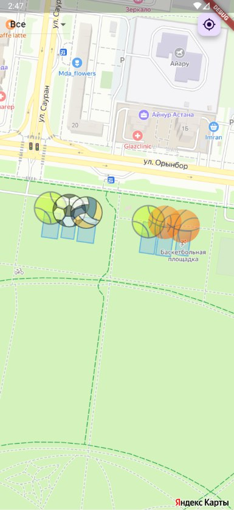

## Sport Events Application

# Architecture 
This app does not have any architecture since I was working with my team from Uni. They don't know NUN about working with states and everything.

# Functionalities
* Authorisation system
* Search for different sport fields
* Register in games 
* Choosing date and time when you are going to arrive at the game
* Check for different fields, photos and descriptions about them
* Users are allowed to leave a review about the field with a rating
* Profile Management system
* Admin Page (CRUD for sport fields and delete users)
* Graphics for each table with info about the attendance of the field (Based on the number of registrations in the field)

# UI
The application welcomes the user with a log in page. So he can log in and go through to the map itself, the user can verify and change the password using E-mail.
The users are shown a Yandex map with different marks on it - they're the types of fields (basketball, soccer, volleyball).
These marks are clickable and the user can see the Schedule of users that registered already, ratings, photos, descriptions and they can fill the form and register in the game.
After the registration info of the user will be on the Schedule. After everything user can click the Profile button on the tab, view and edit the profile.
The admin can do whatever he wants, edit all the fields, delete them, add new ones, delete users and there is an another tab button for Admin Page.

